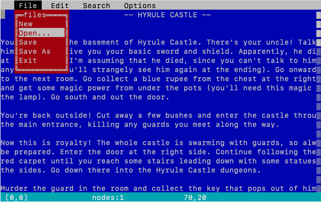

# jex
MS-DOS like text editor for Linux and Mac command line

Jex is a text editor for unix command line that is in the early stages of development. 
The general idea is to create a simple text editor in the style of the classic blue MS-DOS text editor.

